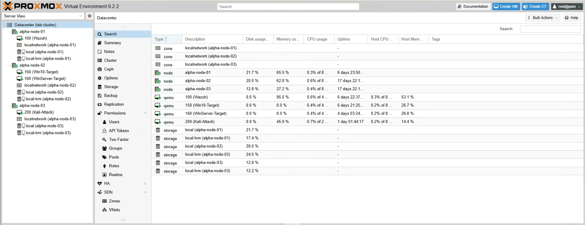

# 🖥️ Project 01: Multi-Node Proxmox VE Cluster & Storage Integration

## 📌 Executive Summary
This project details the setup, hardware allocation, and virtual networking of a 3-node **Proxmox Virtual Environment (VE)** cluster paired with a dedicated Network Attached Storage (NAS) node. The primary goal was to establish a resilient, high-density compute foundation to isolate security workloads, Active Directory infrastructure, and offensive testing environments across physical hardware nodes.

---

## 🛠️ Cluster Hardware Architecture & Node Roles

The cluster consists of three physical **Dell OptiPlex 7090 Ultra** nodes managed under a unified Proxmox datacenter interface, alongside a dedicated NAS host:

| Host / Node | Physical Specs | Dedicated Role | Guest VMs / Containers |
| :--- | :--- | :--- | :--- |
| **PVE Node 1** | Dell OptiPlex 7090 | Defensive Monitoring / SIEM | **Wazuh Manager** (Ubuntu Server / Elastic Indexer Stack) |
| **PVE Node 2** | Dell OptiPlex 7090 | Enterprise Target Infrastructure | **Windows Server 2022** (Domain Controller) & **Windows 10 Pro** |
| **PVE Node 3** | Dell OptiPlex 7090 | Offensive Security & Auditing | **Kali Linux** (Attack Simulations) |
| **NAS Host** | Dedicated PC (6x 500GB RAID 5) | Shared Storage & Log Archives | OpenMediaVault / TrueNAS (NFS & SMB Shares) |

---

## ⚙️ Key Implementation & Configuration Steps

### 1. Cluster Creation & Quorum Setup
1. Installed **Proxmox VE** on each individual Dell OptiPlex node.
2. Created a unified cluster on Node 1 via the Proxmox Datacenter web console:
   ```bash
   pvecm create proxmox-cluster
3. Joined Nodes 2 and 3 using generated cluster join keys to establish quorum across the 3-node architecture.

### 2. Network Bridging & Inter-VM Connectivity
To allow seamless VM-to-VM communication across physical nodes without public routing issues:
* Configured virtual bridge interfaces (`vmbr0`) on each Proxmox node, attached to the physical Gigabit NICs.
* Connected all nodes to the **TP-Link 1Gbps Unmanaged Switch** behind the **GL.iNet Edge Gateway**.
* Assigned static IP addresses to each Proxmox host to ensure stable management plane access.

### 3. NAS Storage Integration
To handle log archiving, shared ISO storage, and VM backups:
* Configured NFS and SMB exports on the dedicated NAS PC (RAID 5 SSD array).
* Added the storage target to the Proxmox Datacenter under **Datacenter -> Storage -> Add NFS**.
* Mapped backup schedules (`vzdump`) to store nightly VM snapshots directly onto the NAS.

---

## 📊 Verification & Cluster Health

### Proxmox Cluster Summary
* **Cluster Name:** `proxmox-cluster`
* **Nodes:** 3 Online (`pve-node1`, `pve-node2`, `pve-node3`)
* **Quorum:** Healthy (3/3 votes)



---

## 💡 Lessons Learned & Technical Challenges

* **Issue:** Initial inter-node communication latency caused intermittent quorum loss.
* **Resolution:** Isolated cluster sync traffic and ensured static leases were mapped explicitly in the GL.iNet router for all node management interfaces.
* **Key Takeaway:** Physical cluster design requires careful IP management and network planning before launching compute-heavy virtual workloads like Wazuh indexers.

---

## 📁 Included Artifacts in this Directory
* `network-interfaces.cfg` - Sanitized `/etc/network/interfaces` configuration for the Proxmox bridges.
* `cluster-status.txt` - Output log from `pvecm status` verifying quorum.
* `cluster-summary.png` - Screenshot of the Proxmox cluster dashboard.
