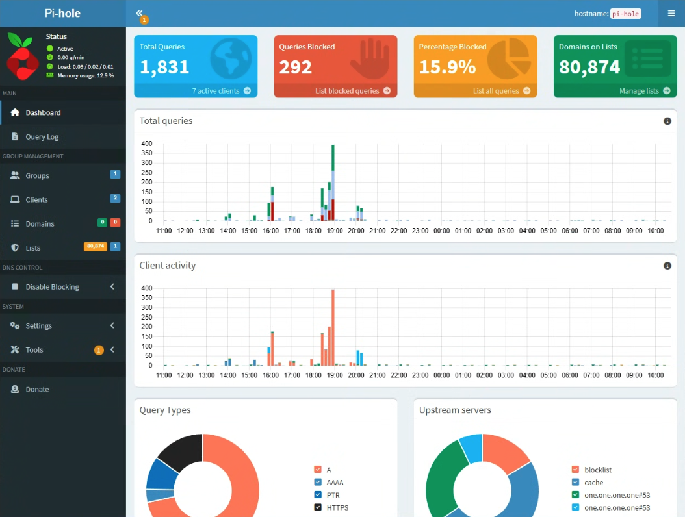

# 🎯 Project 03: Pi-hole Centralized DNS Filtering & Active Directory Integration

## 📌 Executive Summary
This project details the deployment and network integration of **Pi-hole** running on a physical Raspberry Pi 3 B+ node. The primary objective was to establish a network-wide DNS sinkhole to block malicious domains, ad networks, and unwanted telemetry at the DNS layer. The installation was specifically configured to work alongside **Active Directory DNS** on Windows Server, enabling conditional forwarding to ensure seamless internal domain resolution (`.local` records) without compromising privacy or network-wide filtering.

---

## 🛠️ Network Architecture & Host Roles

| Host / Device | Physical / Virtual Specs | Dedicated Role | Key Services / Configurations |
| :--- | :--- | :--- | :--- |
| **raspberrypi** | Raspberry Pi 3 Model B+ | Centralized DNS Sinkhole | Pi-hole, FTL DNS engine, Blocklists, Local DNS |
| **alpha-node-02 (WinServer-Target)** | VM on Proxmox Node 2 | Domain Controller / Internal DNS | Active Directory DS, Windows DNS Server, Forwarders |
| **alpha-node-02 (Win10-Target)** | VM on Proxmox Node 2 | Domain Client | Windows 10 Enterprise, DHCP Client |

---

## ⚙️ Key Implementation & Configuration Steps

### 1. Pi-hole Base Installation & Network Setup
1. Installed **Raspberry Pi OS Lite** onto the Raspberry Pi 3 B+ hardware node.
2. Configured a static IP address (`10.10.10.15`) to ensure consistent DNS routing across the lab.
3. Deployed the Pi-hole automated installation script and configured administrative web controls:
   ```bash
   curl -sSL https://install.pi-hole.net | bash
   ```

### 2. Active Directory Integration & Conditional Forwarding
To preserve internal domain lookup while securing external DNS queries:
* **Active Directory DNS Forwarder:** Configured Windows Server DNS (`WinServer-Target`) to forward all non-local root queries directly to the Pi-hole instance (`10.10.10.15`).
* **Pi-hole Conditional Forwarding:** Enabled Conditional Forwarding under **Settings -> DNS -> Conditional Forwarding**:
  * **Local Network CIDR:** `10.10.10.0/24`
  * **Domain Name:** `Corp.Lab`
  * **Domain Controller IP:** `10.10.10.50`
* **Result:** Pi-hole query logs display resolved Active Directory computer hostnames rather than raw IP addresses.

### 3. Blocklist Ingestion & Custom DNS Records
* Added consolidated threat intelligence feeds (e.g., StevenBlack blocklists) targeting malicious domains, telemetry endpoints, and phishing vectors.
* Mapped custom local DNS records (`Custom DNS -> Local DNS Records`) for quick navigation to infrastructure web portals (e.g., `proxmox.lab`, `wazuh.lab`).

---

## 📊 Verification & Telemetry Testing

### DNS Sinkhole Resolution
* Executed `nslookup` against a known ad-tracking domain from domain-joined client `WKSTN01`:
  ```cmd
  nslookup doubleclick.net
  ```
  * **Result:** Resolves to `0.0.0.0` / `127.0.0.1` (successfully sinkholed).

### Internal Active Directory Domain Resolution
* Executed `nslookup` against the Domain Controller from `WKSTN01`:
  ```cmd
  nslookup winserver.local
  ```
  * **Result:** Resolves directly to `10.10.10.50` via Active Directory DNS forwarding.



---

## 💡 Lessons Learned & Technical Challenges

* **Issue:** Infinite DNS recursion loops occurred when Pi-hole forwarded requests to AD DC while AD DC forwarded root requests back to Pi-hole.
* **Resolution:** Strictly set AD DC as the primary DNS server for all DHCP clients, using Pi-hole strictly as the external upstream forwarder for the DC.
* **Key Takeaway:** Dual-DNS architectures require clear hierarchy boundaries to avoid resolution bottlenecks and query loops.

---

## 📁 Included Artifacts in this Directory
* `pihole-dashboard.png` - Screenshot of the Pi-hole administrative dashboard showing blocked queries and domain totals.
* `dns-lookup-test.txt` - Terminal log output verifying sinkhole domain blocking (`0.0.0.0`) and internal AD resolution.
