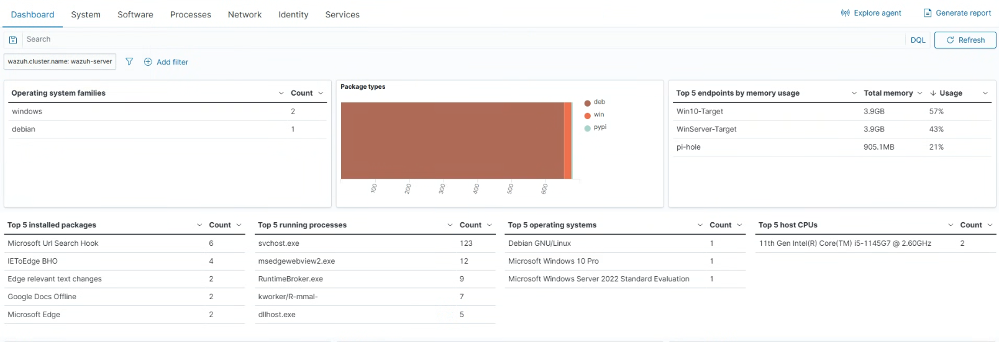

# 🛡️ Project 04: Centralized Wazuh SIEM Deployment & Telemetry Pipeline

## 📌 Executive Summary
This project details the setup, configuration, and agent integration of a **Wazuh SIEM (Security Information and Event Management)** stack hosted on Proxmox VE. The primary goal was to establish a centralized security monitoring platform capable of ingesting, parsing, and analyzing log telemetry in real-time across Active Directory Domain Controllers, Windows endpoints, Linux server nodes, and network edge services.

---

## 🛠️ Telemetry Pipeline Architecture & Host Roles

The Wazuh SIEM pipeline ingests host and network telemetry across the following virtual and physical nodes:

| Host / Node | Physical / Virtual Specs | Dedicated Role | Guest Services / Telemetry Source |
| :--- | :--- | :--- | :--- |
| **alpha-node-01** | Dell OptiPlex 7090 Ultra | SIEM Manager & Indexer | **Wazuh Manager**, Elastic Indexer Stack, Wazuh Dashboard |
| **alpha-node-02 (WinServer-Target)** | VM on Proxmox Node 2 | Target Domain Controller | Windows Server 2022, Security Audit Logs, Sysmon |
| **alpha-node-02 (Win10-Target)** | VM on Proxmox Node 2 | Target Workstation | Windows 10 Enterprise, Security Events, Sysmon Execution Logs |
| **alpha-node-03** | VM on Proxmox Node 3 | Offensive Security Node | Kali Linux, Security Audit Logs, Command History |

---

## ⚙️ Key Implementation & Configuration Steps

### 1. Wazuh Manager & Indexer Stack Deployment
1. Provisioned an Ubuntu Server 22.04 LTS virtual machine on `alpha-node-01`.
2. Installed and configured the single-node Wazuh Indexer, Manager, and Dashboard stack.
3. Applied TLS certificates, system memory map adjustments (`vm.max_map_count`), and secure management plane settings.

### 2. Multi-Platform Agent Ingestion Pipeline
* **Windows Host Agents (`WinServer-Target`, `Win10-Target`):** Deployed the `wazuh-agent` service and configured `ossec.conf` to ingest critical log channels:
  * Windows Security Event Log (`Event ID 4624`, `4625`, `4688`, `4720`)
  * Windows System & Application Logs
  * `Microsoft-Windows-Sysmon/Operational` (Process creation, network connections, file creation)
* **Linux Agents (`alpha-node-03` / Kali):** Installed Linux `wazuh-agent` binary, forwarding authentication (`/var/log/auth.log`) and system execution events over port `1514/TCP`.

### 3. Custom Decoders & Security Alerting Rules
Configured custom detection logic within `/var/ossec/etc/rules/local_rules.xml` to flag malicious behavior:
* **Rule ID 100002:** Triggers high-severity alert on repeated failed logon attempts against Active Directory accounts.
* **Rule ID 100003:** Triggers alerts when administrative command-line tools or shadow copy deletion utilities (`vzdump`, `vssadmin`, `whoami /priv`) are executed via Sysmon Event ID 1.

---

## 📊 Verification & Threat Detection Testing

### Brute-Force & Account Lockout Detection
* Simulated 10 failed logon attempts against `Win10-Target`.
* **Result:** Wazuh Dashboard instantly raised a Level 10 alert for `Windows: Multiple failed logons from same source`.

### Process Telemetry & Command Inspection
* Executed system reconnaissance commands from `Win10-Target` Command Prompt.
* **Result:** Sysmon captured full command-line arguments and shipped them to Wazuh Manager, rendering process tree events in the dashboard.

---

## 💡 Lessons Learned & Technical Challenges

* **Issue:** Wazuh Manager was initially dropping Sysmon process creation events due to unmapped log channel locations in default client configs.
* **Resolution:** Added explicit `<location>Microsoft-Windows-Sysmon/Operational</location>` entries to the `ossec.conf` file on all Windows hosts.
* **Key Takeaway:** Endpoint agents require explicit log channel targeting to ensure high-fidelity telemetry reaches the SIEM indexer.

---

## 📁 Included Artifacts in this Directory
* `wazuh-dashboard-overview.png` - Screenshot of the Wazuh Dashboard showing connected agents and alert trends.
* `custom-local-rules.xml` - Exported XML configuration containing custom detection rules written for Wazuh Manager.
* `agent-status-list.txt` - Terminal output log from `agent_control -l` confirming active agent connections.
* `sysmon-alert-evidence.png` - Screenshot showing a captured Sysmon Event ID 1 process creation alert in the Wazuh UI.
