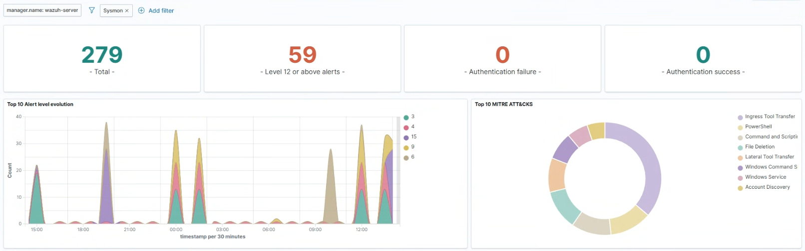

# ⚔️ Project 05: Automated Attack Simulation & Threat Hunting (MITRE ATT&CK Mapping)

## 📌 Executive Summary
This project details the execution of controlled cyber attack simulations and threat hunting exercises within the isolated Proxmox lab environment. Utilizing **Kali Linux** and **Atomic Red Team**, adversary techniques aligned with the **MITRE ATT&CK framework** were executed against the Active Directory domain controller and enterprise endpoints. The objective was to validate defense mechanisms, refine Wazuh SIEM detection rules, and verify full telemetry visibility across process creation, memory inspection, and network connection events.

---

## 🛠️ Attack Environment Architecture & Host Roles

The attack simulations and threat hunting pipeline involve the following virtual and physical nodes:

| Host / Node | Physical / Virtual Specs | Dedicated Role | Target / Function |
| :--- | :--- | :--- | :--- |
| **alpha-node-03 (Kali-Attack)** | VM on Proxmox Node 3 | Offensive Security Node | Kali Linux, Atomic Red Team Framework, Nmap |
| **alpha-node-02 (WinServer-Target)** | VM on Proxmox Node 2 | High-Value Target | Windows Server 2022 (Domain Controller), Sysmon, Wazuh Agent |
| **alpha-node-02 (Win10-Target)** | VM on Proxmox Node 2 | Endpoint Target | Windows 10 Enterprise, Sysmon, Local Security Audit Policies |
| **alpha-node-01 (Wazuh-SIEM)** | VM on Proxmox Node 1 | Defense & Telemetry Node | Wazuh Manager, Elastic Indexer Stack, Alerting Engine |

---

## ⚙️ Key Implementation & Configuration Steps

### 1. Attack Framework Deployment & Tooling Setup
1. Provisioned an isolated Kali Linux virtual machine on `alpha-node-03`.
2. Installed PowerShell Core and deployed the **Invoke-AtomicRedTeam** execution framework:
   ```powershell
   Install-Module -Name Invoke-AtomicRedTeam -Scope CurrentUser
   IWR https://raw.githubusercontent.com/redcanaryco/invoke-atomicredteam/master/install-atomicredteam.ps1 -UseBasicParsing | IEX
   ```
3. Configured API connectivity to safely trigger controlled atomic tests against target Windows hosts (`Win10-Target`, `WinServer-Target`).

### 2. MITRE ATT&CK Technique Execution
Executed targeted atomic tests mapped to core threat actor Tactics, Techniques, and Procedures (TTPs):
* **Discovery (`T1087.002` - Domain Account Discovery):** Querying Active Directory users and group memberships via `net user /domain` and `Get-ADUser`.
* **Persistence (`T1053.005` - Scheduled Task):** Creating persistence via hidden Windows Task Scheduler entries (`schtasks /create`).
* **Credential Access (`T1003.001` - LSASS Memory Dumping):** Simulating LSASS memory access techniques using `rundll32.exe comsvcs.dll, MiniDump`.

### 3. Detection Rule Tuning & SIEM Correlation
* Correlation rules were cross-referenced against incoming Sysmon Event ID 1 (Process Creation) and Event ID 10 (Process Access) in the Wazuh SIEM.
* Custom rules were refined in Wazuh to escalate alert severity upon detecting command-line flags matching known adversary tools.

---

## 📊 Verification & Threat Detection Testing

### Technique Simulation: T1087.002 - Domain Account Discovery
* Executed domain enumeration from `Win10-Target`:
  ```cmd
  net group "Domain Admins" /domain
  ```
* **Detection Result:** Sysmon captured the command line arguments; Wazuh triggered Level 7 Alert (`Active Directory Reconnaissance Activity Detected`).

### Technique Simulation: T1053.005 - Scheduled Task Persistence
* Executed scheduled task creation:
  ```cmd
  schtasks /create /tn "Updater" /tr "C:\Windows\System32\cmd.exe" /sc onstart /ru "SYSTEM"
  ```
* **Detection Result:** Captured via Security Event ID `4698` (A scheduled task was created) and Sysmon Event ID 1; Wazuh raised a Level 10 Persistence alert.



---

## 💡 Lessons Learned & Technical Challenges

* **Issue:** Default Windows Event Logging failed to capture `schtasks.exe` payload parameters, preventing the SIEM from detecting malicious scheduled task commands.
* **Resolution:** Enabled Advanced Audit Policy `Audit Scheduled Task Creation` under `Computer Configuration -> Security Settings -> Advanced Audit Policy Configuration -> System Events`.
* **Key Takeaway:** Adversary simulation frameworks like Atomic Red Team are essential for identifying blind spots in SIEM rules before real-world security incidents occur.

---

## 📁 Included Artifacts in this Directory
* `attack-detection-alert.png` - Screenshot of the Wazuh Dashboard showing triggered MITRE ATT&CK alerts.
* `atomic-test-results.txt` - Execution log output from Invoke-AtomicRedTeam test runs.
* `mitre-detection-rules.xml` - Custom Wazuh XML rules mapped to MITRE ATT&CK T1087, T1053, and T1003.
