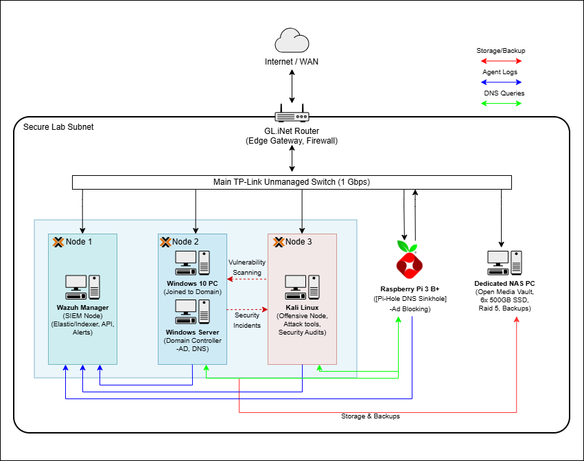

# 🛡️ Enterprise Simulation & Security Operations Homelab

A multi-node, cluster-based homelab environment engineered to simulate a small-scale enterprise network. This project demonstrates practical capabilities in **virtualization, systems administration, Active Directory management, DNS sinkholing, and defensive SIEM engineering**.

Rather than isolated experiments, this lab operates as an integrated, production-style ecosystem designed to capture endpoint and network telemetry, enforce least-privilege identity management, and monitor attack vectors mapped to the **MITRE ATT&CK framework**.

---

## 🏛️ Network Topology

* **Edge Gateway:** Isolated lab subnet routed through a GL.iNet firewall/gateway.
* **Compute Cluster:** 3-node Proxmox VE cluster segregating defensive SIEM (Node 1), Active Directory environment (Node 2), and offensive testing tools (Node 3).
* **Storage & Edge Services:** Dedicated NAS for log archiving/backups alongside a Raspberry Pi hardware DNS sinkhole.

---

## 📁 Project Modules & Detailed Documentation

Instead of a single dense write-up, deep-dive implementation details, configuration files, and verification logs are organized into dedicated project modules:

| Project Module | Domain Focus | Key Technologies |
| :--- | :--- | :--- |
| [**01. Proxmox Cluster Deployment**](./Projects/01-proxmox-cluster-setup/) | Virtualization & Compute | Proxmox VE, Multi-Node Bridging, Storage Integration |
| [**02. Active Directory & GPO Hardening**](./Projects/02-active-directory-hardening/) | IAM & Systems Admin | Windows Server 2022, Sysmon, Audit Policies |
| [**03. Pi-hole Centralized DNS Filtering**](./Projects/03-pihole-dns-sinkhole/) | Network Services | Raspberry Pi OS, DNS Sinkholing, AD Forwarding |
| [**04. Wazuh SIEM & Telemetry Pipeline**](./Projects/04-wazuh-siem-telemetry/) | Security Engineering | Wazuh Manager/Agents, Syslog, JSON Log Parsing |
| [**05. Attack Simulations & Detection**](./Projects/05-attack-simulation-threat-hunting/) | Blue Teaming & Threat Hunting | Kali Linux, MITRE ATT&CK Mapping, Custom XML Rules |

---

## 📜 Technical Skills Mapped to Certifications

### 🔹 CompTIA A+
* **System Operations:** Hypervisor provisioning, hardware lifecycle management, and Linux/Windows OS deployment.
* **Hardware & Storage:** RAID 5 array configuration, network-attached storage mounting, and hardware resource allocation.

### 🔹 CompTIA Network+
* **Architecture & Flow:** Subnet isolation, cross-node virtual switch creation, and edge gateway filtering via GL.iNet.
* **Core Network Services:** Centralized DNS resolution architecture pairing Active Directory DNS with upstream Pi-hole sinkholing.

### 🔹 CompTIA Security+ & Blue Team Operations
* **SIEM Engineering:** Deploying and managing Wazuh agents across heterogeneous endpoints (x86 Windows/Linux and ARM64 Linux).
* **Telemetry & Hardening:** Advanced Windows Security Audit policy configuration via GPOs, Sysmon integration, and centralized log shipping.
* **Identity & Access Management (IAM):** Active Directory OU hierarchy design, tiering administrative permissions, and enforcing least privilege.

---

## 🛠️ Hardware Stack & Workload Allocation

| Component | Hardware | Workload / Function |
| :--- | :--- | :--- |
| **Edge Gateway** | GL.iNet GL-1200 | Primary lab router, DHCP server, and network firewall isolating lab traffic from home network. |
| **Network Switch** | TP-Link TL-SG108E | 1 Gbps distribution switch connecting physical cluster nodes and storage devices. |
| **Cluster Node 1** | Dell Optiplex 7090 | Proxmox Node hosting the **Wazuh SIEM Manager** (Elasticsearch/Indexer stack). |
| **Cluster Node 2** | Dell Optiplex 7090 | Proxmox Node hosting **Windows Server 2022 (Domain Controller)** & **Windows 10 Enterprise Client**. |
| **Cluster Node 3** | Dell Optiplex 7090 | Proxmox Node hosting **Kali Linux** for controlled attack simulations and auditing. |
| **DNS Gateway** | Raspberry Pi 3 B+ | Hardware node running **Pi-hole** for network-wide DNS sinkholing and domain filtering. |
| **Central NAS** | Dedicated PC | OpenMediaVault / TrueNAS running **RAID 5** (6x 500GB SSDs) for backups and log archiving. |

---

## 🎯 Design Philosophy

* **Centralization:** Single-pane-of-glass monitoring for all network and host events via Wazuh SIEM.
* **Isolation & Containment:** Strict separation between defensive logging, target production environments, and offensive execution nodes.
* **Data Fidelity:** Ingesting raw, high-value endpoint telemetry (Sysmon) rather than relying solely on default system logs.
* **Reproducibility:** All configurations, rules, and scripts are stored as code within this repository for rapid deployment.

---

## 🚀 Future Roadmap

* [ ] Upgrade unmanaged switch to a managed Layer 2 switch to implement 802.1Q VLAN network segmentation.
* [ ] Integrate a SOAR platform (Shuffle) to automate active response actions (e.g., automated IP blocking upon detection).
* [ ] Implement Docker-based containerized deployments for secondary infrastructure services.
